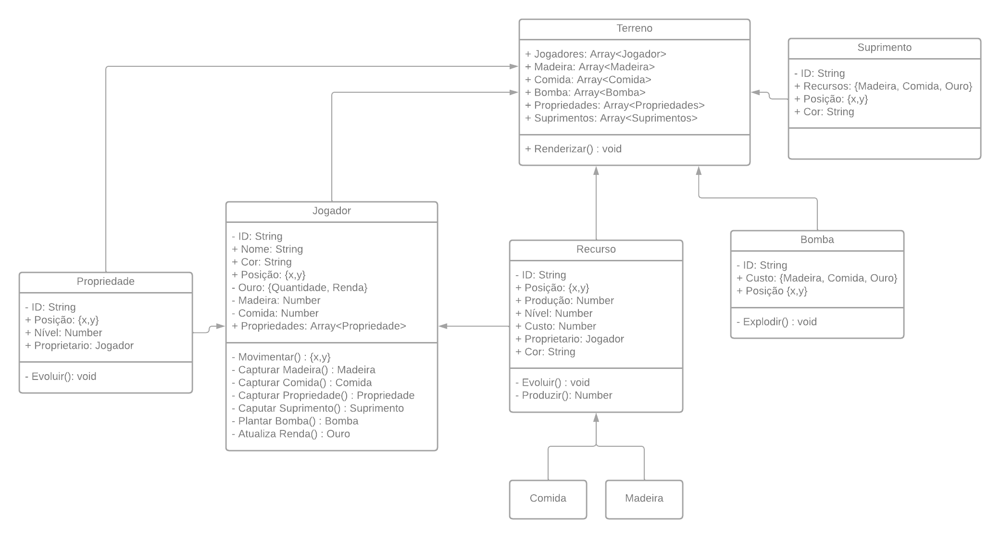

# Pixelmination

Este é um projeto pessoal, com o principal objetivo de ser um aprendizado rico por meio do processo da criação de um jogo, Pixelmination, inicialmente usando React para a apresentação visual do game, e Node para a criação do servidor e comunicação entre os jogadores durante a partida.

## Objetivo do Jogo

O jogo é baseado em um terreno pixelado, cada unidade do terreno pode representar uma estrutura de acordo com a sua cor e forma. O objetivo do jogo é o jogador conquistar a maior quantidade de unidades(propriedades) dentro deste terreno, após não existir mais propriedades a serem conquistadas o jogo acaba e o jogador com a maior quantidade vence a partida.

### Estruturas e Recursos

O jogo contem estruturas e recursos para o dinamismo durante a dominação de cada jogador

- Propriedade: Unidade a ser conquista, todo o terreno que não contenha uma outra estrutura já posicionada, exige os recursos madeira, comida e ouro para ser dominado;
- Madeira: Gera o recurso madeira, necessário para dominar uma propriedade;
- Comida: Gera o recurso comida, necessário para dominar uma propriedade;
- Suprimento: Fornece quantidades de Madeira comida e Ouro;
- Bomba: Usado para destruir propriedades de nível 2.

### Arte

A arte do jogo será baseado em unidades de 9 x 9 pixels, alterando sua cor e forma para identificação dos elementos que compões o jogo.

### Diagrama de Classe

No diagrama abaixo a primeira ideia dos elementos que compõe o jogo e como eles se relacionam entre si, passível a modificações a qualquer momento conforme o desenvolvimento do jogo.

## Pensamentos do Autor

- 28/06/2023
Este seria um pequeno documento da concepção de ideia de um jogo que pensei em desenvolver, para me ajudar no processo de desenvolvimento, já que será algo mais complexo do que eu normalmente fiz, onde com uma pincelagem mental no planejamento das coisas eu já começava a escrever código.